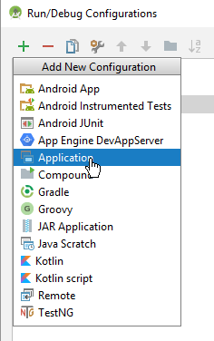
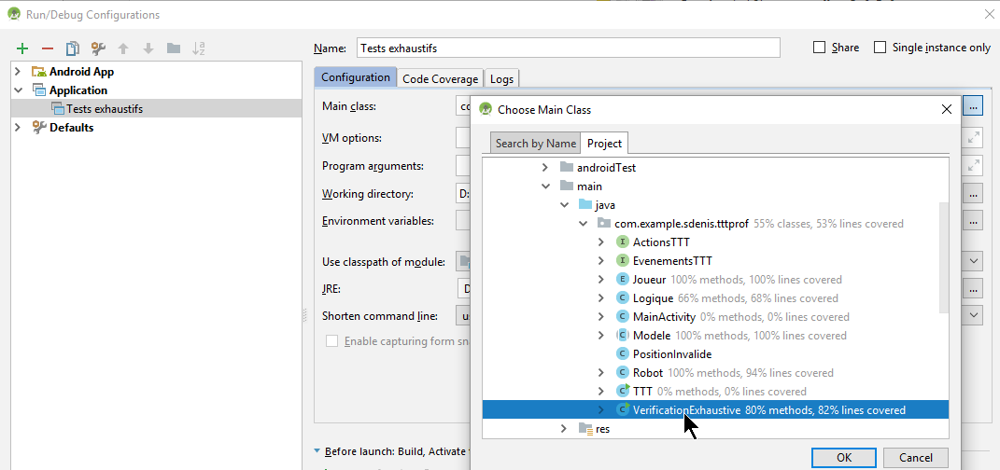
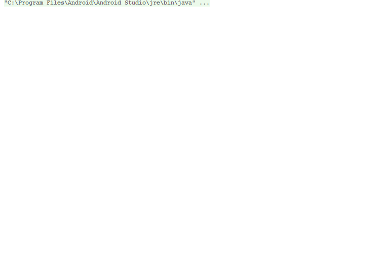

# TP1
TP#1 Jeu de Tic Tac Toe - Console et Android

---
## Instructions de conception

http://didact.stephanedenis.cc/#!420-GEP-HY/TP/TTT/index.md

---

## Outil de test pour valider votre robot/ai

Vous pouvez récupérer le code sur https://github.com/420-GEP-HY/TP1

Le fichier VerificationExhaustive.java est une application de type console que vous devez ajouter à votre projet. Vous aurez certainement à changer le nom de paquetage en première ligne pour qu'il s'intègre parfaitement à votre application. Il suffit ensuite d'ajouter une nouvelle configuration de lancement pour exécuter le "main".

---

